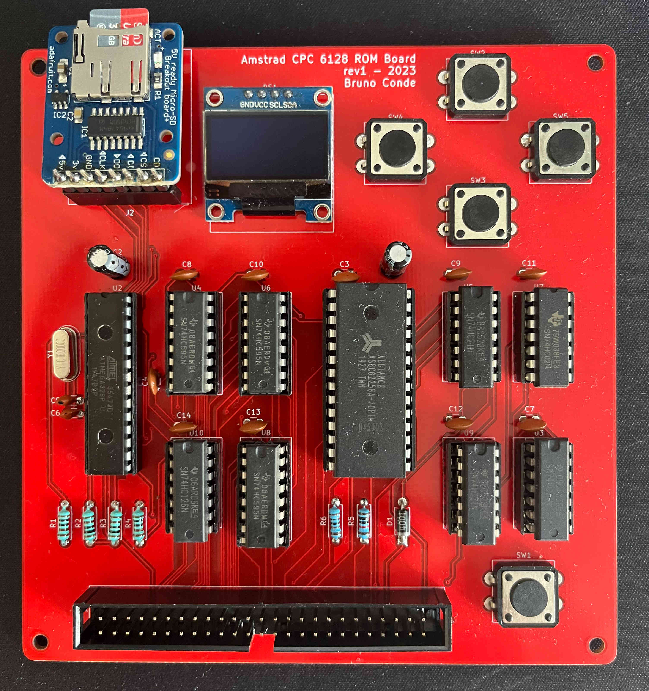
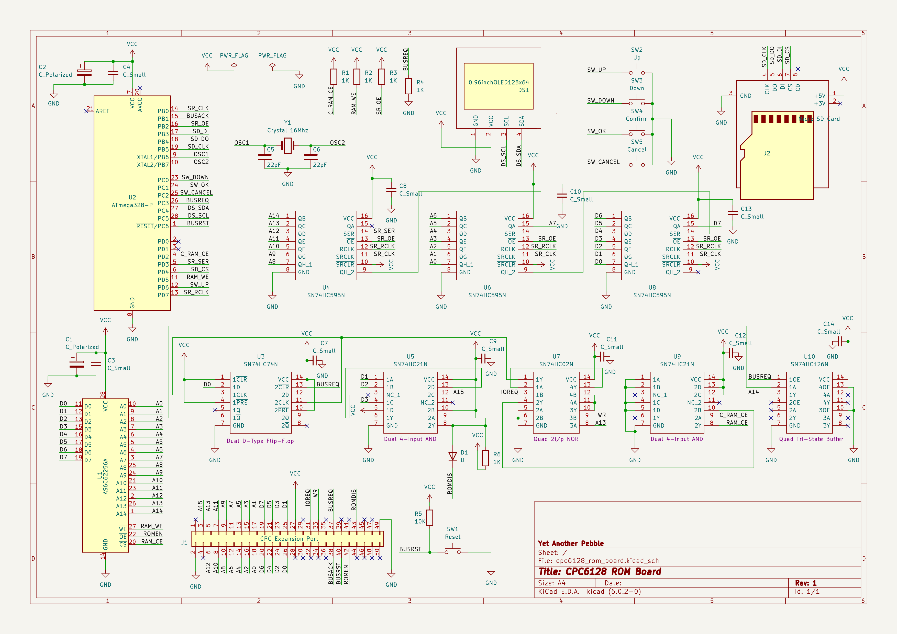

# Amstrad CPC 6128 ROM Board

A ROM Board for the Amstrad CPC 6128 capable of loading two expansion ROMs simultaneously from an SD card.

Nowadays, there are plenty of [ROMS available for the Amstrad CPC](http://www.cpcwiki.eu/index.php/ROM_List).
This board allows you to load any ROM present on an SD card as an expansion ROM on the Amstrad CPC 6128. You can bank up to two ROMs at the same time since there are many programs and games that require two ROMs loaded concurrently. In order to select which expansion ROMs should be made available for the Amstrad CPC, the ROM Board provides a small OLED display and buttons that allow the user to browse the SD card files and choose the Upper and Lower ROM specifically.

The ROM board connects to the [expansion port](https://www.cpcwiki.eu/index.php/Connector:Expansion_port) of the Amstrad CPC6128. Here is a picture of the assembled board:

  

&nbsp;

## User interface

Upon startup, the selected ROMs for the upper and lower positions are loaded to the SRAM. The display shows the loading progress of each ROM. Once the ROMS are loaded, the display shows the ROM names that are currently loaded.

In order to select ROMs from the SD card, five buttons are provided so that the user can:
 - **SELECT** a given ROM for the upper or lower ROM position
 - **CANCEL** the selected action and return to the loaded ROMs initial screen.
 - Move **UP** and **DOWN** the ROM root folder on the SD card
 - **RESET** the Amstrad CPC and the ROM Board

**Browsing ROMs:**

 - From the main screen, click on the UP or DOWN buttons to enter the browsing mode.
 - In browsing mode, navigate using the UP and DOWN buttons to choose a ROM file from the SD card.

**Selecting a ROM:**

 - Once the desired ROM is chosen, press the SELECT button.
 - A new screen will appear, prompting the user to select the ROM bank position: Lower or Upper.
 - Switch between the lower and upper bank by using the UP and DOWN buttons.

**Saving the ROM:**

 - Press the SELECT button to save the ROM file on the selected bank.
 - To complete the process, restart the Amstrad CPC. This can be done by turning off and on the computer or using the RESET button on the ROM Board.

**Canceling ROM Selection:**

 - If you wish to cancel the ROM selection, press the CANCEL button.
 - You will be returned to the main screen.

## Demonstration video

## The circuit

The circuit can be divided into two parts:
 1. ROM loading, browsing and selection
 2. ROM expansion interface with the Amstrad CPC

The common part between them is the address bugs, the data bus and the SRAM that holds the loaded ROMs.

Ensuring that only one device assumes control of the bus at all times is a crucial aspect to consider. Because we are using the same address and data bus of the Amstrad CPC, when the Amstrad CPC is accessing the bus, the ROM Board shift registers must be tri-stated. Likewise, whenever the ROM Board is accessing the bus in order to load the ROMs, the Amstrad CPC must release control of the bus. This is accomplished by requesting control of the bus through the BUSREQ line being pulled low.

### ROM loading, browsing and selection

The ROM board is based on a atmega328p microcontroller, the same microcontroller that you can find on development boards such as the Arduino Uno. The atmega328p is responsible for loading the selected ROMs (upper and lower) from the SD card into a 32K SRAM (**AS6C62256A**) when the Amstrad CPC boots up.

The loading duration for both ROMs is approximately 5 seconds. Therefore, we need a way to hold the CPC6128 until the ROMs finish loading. This can be achieved using the **BUSREQ** and **BUSACK** lines on the Z80. When the Amstrad CPC starts up, the ROM Board will immediately pull the **BUSREQ** LOW with a pull low resistor. Once the **BUSACK** line is LOW, the Z80 is signaling that control of the address bus, data bus and output signals has been released, and our ROM Board can take control and it starts loading the ROMs. When the atmega328p finishes loading the ROMS, it will pull the **BUSREQ** HIGH and the Z80 resumes processing.

In order to copy the ROM data from the SD card into the SRAM memory, three 8-bit shift registers are used as there aren't enough GPIO pins on the atmega328p for the 15 address lines, 8 data lines and multiple other control signals needed for the ROM board.

Once the ROMs are loaded and the Amstrad CPC has completed the boot process, the user can interact with the ROM Board in order to configure additional ROMs by browsing the SD card and selecting the Upper and Lower ROM. The selected ROMs will be saved within the atmega328p internal EEPROM. In order to load the newly selected ROMs, the Amstrad CPC and the ROM Board must be restarted.

### ROM expansion interface with the Amstrad CPC

Whenever the CPC wants to communicate with the Upper ROM, it will first write a byte with the selected Upper ROM bank number into port **$DF00**. There can be up to 252 expansion ROMS mapped over the top 16K of memory, starting at #C000. After this, the **ROMEN** signal will go LOW, and the CPC will start addressing the Upper ROM.

We must guarantee that there is a unique Upper ROM enabled at any given time. Therefore, whenever an expansion ROM is active, the internal CPC Upper ROM must be disabled. This is done by bringing the **ROMDIS** line LOW, a signal conveniently provided by the CPC for this purpose. After this, any memory requests to the ROM’s address space will be handled solely by the selected expansion ROM.

The CPC does not store the selected ROM Bank number anywhere. Peripheral devices are responsible for latching the selected ROM bank whenever the bank number is written to port **$DF00**.

Our ROM Board supports up to two ROMs mapped for the Amstrad CPC Upper ROM bank. These ROMs are located at positions **#14** and **#15** (that we call Upper and Lower ROMS on the ROM Board).

Whenever the Amstrad CPC tries to select a given ROM through the IO port, if the ROM being selected is provided by the ROM Board (#14 or #15) then a latch is used to store this information. Another latch is used to store which of the ROMs was selected: #14 or #15. A Dual D-Type flipflop (SN74HC74N) was used for these latches.

The Tristate buffer (SN74HC126N) is used to tie the A14 line to the selected upper or lower ROM stored in the previous latch. The A14 line must be tri-stated from the Amstrad CPC bus whenever the ROMS are being loaded.

You can find more detail information regarding the build of this ROM Board in the following post:
[https://bmpc.github.io/amstrad-cpc-rom-board](https://bmpc.github.io/amstrad-cpc-rom-board/).

### Schematic

  

### BOM

 - Atmega328             x1
 - 74HC595N              x3 (shift registers)
 - 74HC74N               x1 (D FlipFlop)
 - 74HC21N               x2 (Dual 4-input AND gate)
 - 74HC126N              x1 (3-state bus buffer)
 - 74HC02N               x1 (Quad 2-input NOR gate)
 - AS6C62256A            x1 (32k sram)
 - 10kΩ  resistor        x1
 - 1.8Ω  resistor        x1
 - 1Ω    resistor        x5
 - 220Ω  resistor        x1
 - 1N4148                x1 (Standard Diode 300mA 75V)
 - 22pF 50V capacitor    x2
 - Push Buttons          x5
 - Cristal 16Mhz         x1
 - MicroSD card breakout x1 (adafruit)
 - 0.96inch OLED         x1 (0.96inch OLED 128X64 w/ SPI/I2C interfaces and vertical pinheader 4pin - White)
 - 02x25 socket          x1 (expansion port)

## References

 - [Building an Amstrad CPC expansion ROM in a breadboard](https://bmpc.github.io/bulding-an-amstrad-cpc-expansion-rom)
 - [Amstrad CPC 6128 ROM Board](https://bmpc.github.io/amstrad-cpc-rom-board)
 - https://www.cpcwiki.eu/index.php/ACU_Romboard_(DIY)
 - https://www.cpcwiki.eu/imgs/3/32/Amstrad_rom_expander.pdf

## *Disclaimer*
*I'm a software engineer with no background in electronics. Please don't consider what you read here to be best practice. Use at your own risk.*

*Nevertheless, feedback is always welcome.*
